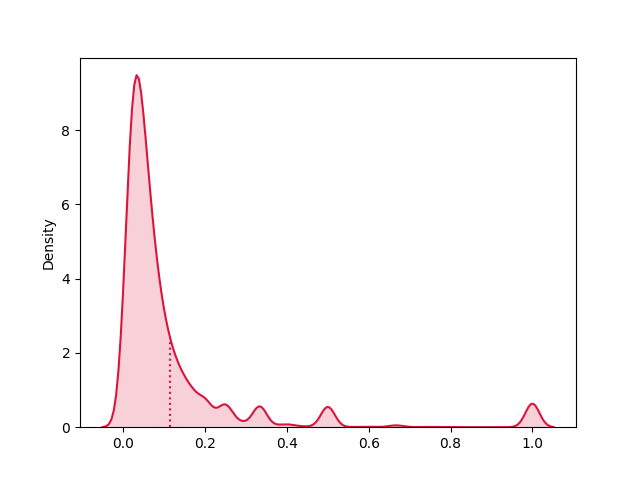
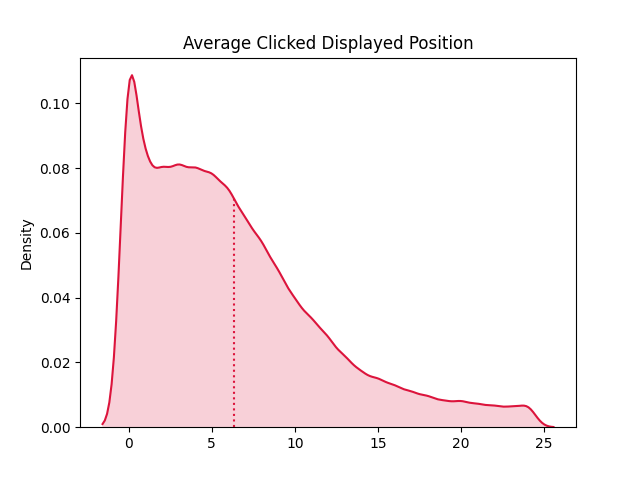
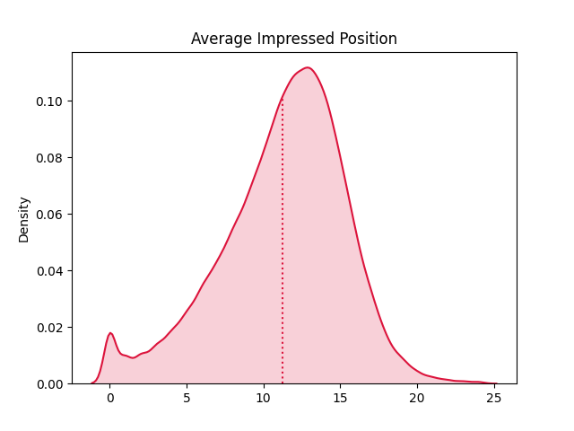
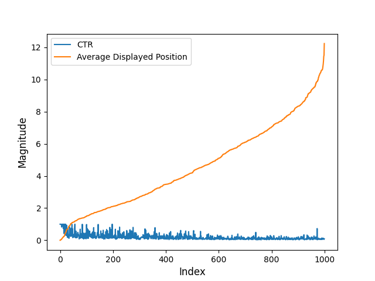

# Statistical Data Analysis

## Introduction

On telecom website, one of the most important user interactions is when the users click on the
`view available SIM Card` button (click-out) on a SIM Card listing (they are then forwarded to the office
website to complete their purchase). This helps us to evaluate the performance of an item and
provide insights for the optimization of the ranking for a user in a specific context. Further, by
analyzing a user’s click-out behavior, we can predict which other SIM card (Type/Number) might be interesting
for him/her.


## Descripption
This project aims to generate insights from the sample datasets which are provided.The interest is mainly about gaining insights regarding click-out distribution and click-through rates (CTR).

## Problem 1 (Clicked items investigation)
The data_analysis_case_study_part_1.csv contains information about items (SIM Cards). Each row displays for each item, it's id, number of times it
was displayed (impressions), number of click-outs (clicks), set of clicked displayed positions (0=first position), average impressed position, number of users and sessions with at least one impression. Only clicks and impressions from the first page results are considered.

### Requirement
1. Calculate the CTR of each item. What is the overall avg CTR? Is there any biasness
in the item CTR calculation?
2. What is the distribution of clicks among the top 25 positions? What is the share of the
first positions? On how many positions are approx. Half of the click-outs made?
3. Describe the relationship between the average displayed position and the clicked
displayed position. What are your thoughts about the variance between the two?
4. In the dataset, we provided you with the average displayed position. What can be
wrong with using averages?

## Problem 2 (Session investigation)
Each row in data_analysis_case_study_part_2.csv
corresponds to a click-out from a user and basic information on the structure could be found at
the followng section.

### Requirement
1. Describe the data set that you have received. Calculate the 5 most frequent values
per column (with frequency). Can you find any suspicious results? If so, what are
they? And how would you fix these for the analysis?
2. Which search type has the lowest average displayed position? What is the best
sorting order for this search type? Which search type should be excluded for a
statistical reason?
3. What are the top 10 `best` and `worst` performing items? Explain what metric you
have chosen to evaluate the performance and why.
4. Describe and visualise the relationship between the average displayed position and
the CTR among the top 1000 most clicked items.

### Column description
* User_id: anonymized cookie id of the visitor
* Session_id: anonymized id of the session
* Clicked_item_id: id of the clicked SIM Card.
* Displayed_position: position, relative to the page, of the item into the list (0=first
position)
* Page_num: cardinal number of the page where the clicked SIM Card was displayed (0=first page)
* Sort_order: categorization of the sorting order of the list (e.g. “sort by popularity”, “focus
on rating”, etc)
* Search_type: categorization of the type of search.
* Path_id: id of the location where the listed items are situated.
* Traffic_type: categorization of the type of the traffic.
* Impressed_items_ids: ids of all the items which were displayed on the same page
where the click-out happened. They are in the order of display.


## Solution
### Clicked items investigation
1. Calculate the CTR of each item. What is the overall avg CTR? Is there any biasness in the item CTR calculation?

* The calculated CTR could be found in output/output11.csv. the file will be generated by running python solution in the following section. The overall average output CTR is 0.114557. There is biasness in the item CTR calculation which can be identified in several ways. As we can see in the frequency distribution plot and the below table which contains the description of CTR column, more than 75% of data is placed before mean value. Also a high difference between mean and median value could be a strong reasons for having outliers in the data.

<p align="center">
  
</p>

2. What is the distribution of clicks among the top 25 positions? What is the share of the first positions? On how many positions are approx. Half of the click-outs made? 
* Before proceeding with this question, I decided to replace -11 in dataset (missing values) with a meaningful value. I chose median for the replacement. After the substitution, the distribution of clicks among the top 25 positions is shown in below table.
<center>

|clicked_displayed_positions|counts_click_top_25|share_prec|
|:----|:----|:----|
|0|505679|0.302243641|
|1|212969|0.127291278|
|2|145547|0.086993241|
|3|110210|0.065872365|
|4|92428|0.055244088|
|5|74113|0.044297238|
|6|65114|0.038918548|
|7|53947|0.032244048|
|8|48173|0.028792936|
|9|42452|0.025373502|
|10|37743|0.022558939|
|11|33002|0.01972525|
|12|30852|0.018440198|
|13|26507|0.015843197|
|14|24429|0.01460118|
|15|23095|0.01380385|
|16|20649|0.012341879|
|17|19322|0.011548733|
|18|17874|0.010683265|
|19|16266|0.009722166|
|20|15274|0.009129249|
|21|14678|0.00877302|
|22|13548|0.008097621|
|23|13301|0.007949989|
|24|15912|0.00951058|
</center>

The share of the first position is equal to 0.3022.  As it is shown in below table Half of the click-outs (among the top 25 positions) are made on the first 3 positions. 
<center>

|Clicked_display_position|position_clicked|Cumulative_position_clicked|Cumulative_position_clicked_scaled|
|:----|:----|:----|:----|
|0|505679|505679|0.604|
|1|212969|718648|0.859|
|2|145547|864195|1.033|

</center>


3. Describe the relationship between the average displayed position and the clicked displayed position. What are your thoughts about the variance between the two?

* The correlation coefficient between the average displayed position and the clicked displayed position is 0.55138 which shows us that an increase in average displayed position moderately predicts an increase in clicked displayed position value. The variance for the values is shown below. 
<center>

|avg_impressed_position|avg_clicked_displayed_positions|
|:----|:----|
|13|30|
</center>

<p align="center">
  
</p>

<p align="center">
  
</p>

* It can be seen from above plots that clicked displays position has a heavy tailed frequency distribution which means a more variance or more spreading data around mean value.

4. n the dataset, we provided you with the average displayed position. What can be wrong with using averages?

* The problem with using average is it can be highly affected by outliers so it is not the best metric for evaluating a variable especially when we have outliers.


### Session investigation
1. Describe the data set that you have received. Calculate the 5 most frequent values per column (with frequency). Can you find any suspicious results? If so, what are they? And how would you fix these for the analysis? 

* The code included in python file and with running, the requierd output will be displayed. a sample column output is listed in below:
<center>

|displayed_position|Frequency|
|:----|:----|
|0|495014|
|1|203090|
|-11|152437|
|2|138789|
|3|108490|

</center>

* There are 1 values which does not make any sense. The -11 in displayed_position column. Regarding the dataset we can find the correct displayed_position for the clicked_item_id in the impressed_item_ids column and replace -11 with this value which is included in the code. 

2. Which search type has the lowest average displayed position? What is the best sorting order for this search type? Which search type should be excluded for a statistical reason?
<center>

|search_type|sort_order|count|
|:----|:----|:----|
|2116|12|278270|
|2116|312|64087|
|2116|21|17729|
|2116|212|7449|
|2116|412|4970|
|2116|41|1679|
|2116|112|988|
|2116|32|224|
|2116|0|187|

|search_type|counts|
|:----|:----|
|2113|928598|
|2116|375583|
|2111|230316|
|2115|194310|
|2114|174986|
|2100|2|


</center>

Due to very low probability of occurrence of this observation, the 2100 search type should be excluded. 

3. What are the top 10 “best” and “worst” performing items? Explain what metric you have chosen to evaluate the performance and why.

* To find the answer to this question I decided to use a combination of “click_count” and CTR. Based on CTR calculation formula which is Number of clicked items divided by impressed items, I had to find number of clicks and number of impressions for each item_id. To find click_count, I just used an aggregation and created a new data frame. Finding number of impressions was a bit more challenging because the last column was not normalized and each row had more than one value in this column. I created another data frame by applying unpivot on this column and then calculated number of impressions for each item_id.  The final data frame was obtained by applying an inner join on these 2 data frames. The final result is a csv file which can be found in /output/output31.csv.
For finding the 10 worst performing items I sorted the data based on click_count values. There are a lot of rows with the click_count equal to 1. For choosing the worst 10 performing items among them, I used CTR value and chose the 10 rows with the lowest CTR.
<center>

|clicked_item_id|clicked_counts|impressed_item_ids|ipression_count|CTR|
|:----|:----|:----|:----|:----|
|920327|1|920327|914|0.001094092|
|6338080|1|6338080|907|0.001102536|
|634266|1|634266|903|0.00110742|
|3223133|1|3223133|899|0.001112347|
|967099|1|967099|845|0.001183432|
|6361592|1|6361592|842|0.001187648|
|4060868|1|4060868|833|0.00120048|
|2155068|1|2155068|783|0.001277139|
|1997203|1|1997203|777|0.001287001|
|1485095|1|1485095|774|0.00129199|

</center>

Finding the best 10 performing items was more challenging. Because there is no limit on the cliked_count value, first I set a threshold on CTR column and chose the rows with the CTR more than 0.4 (this threshold seemed reasonable after going through the data). Then I sorted these rows based on cliked_count value in a descending order and chose the top 10 for the best performing items.
<center>

|clicked_item_id|clicked_counts|impressed_item_ids|ipression_count|CTR|
|:----|:----|:----|:----|:----|
|1455251|2297|1455251|3455|0.664833575|
|436036|1544|436036|2413|0.639867385|
|2055010|1507|2055010|2192|0.6875|
|117840|1049|117840|1476|0.710704607|
|1330971|989|1330971|1381|0.716147719|
|148313|907|148313|1754|0.517103763|
|100770|772|100770|1285|0.60077821|
|99018|724|99018|1215|0.595884774|
|93388|662|93388|849|0.779740872|
|640926|658|640926|1541|0.426995457|

</center>

4. Describe and visualize the relationship between the average displayed position and the CTR among the top 1000 most clicked items.

* First I calculated the top 1000 most clicked items, then I filtered the original dataset by these item ids. Then I replace missing value -11 displayed_position with its corresponding position in impressed_item_ids. This task has been done with normalizing dataframe based on impressed_item_ids, applying a window function and some handy work on resulting dataset. After that I was able to calculate average displayed position and the CTR among the top 1000 most clicked items. The final data frame can be found in /output/output4.csv. Based on the below plot and the correlation value which is -0.514, <b> we can conclude that an increase in CTR moderately predicts a decrease in average displayed position value </b>.


<p align="center">
  
</p>


## Getting Started

This section explains how to run this App. I have tried to make it very simple. 

### Prerequisites
The required prerequisites are:

* Python 3
* Internet connection to download required images

### Run

Follow the steps below to run the App.

   ```sh
   $ python brgroup_Py.Sol.py
   ```

   ```sh
   $ python brgroup_Py.Sol2.py
   ```


## Author

👤 **Tayebe Mohamadi**

- Github: [@TayebeMohamadi](https://github.com/TayebeMohamadi)

## Version History
* 0.1
    * Initial Release

